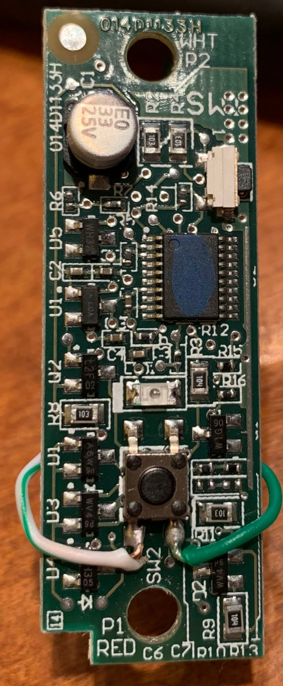
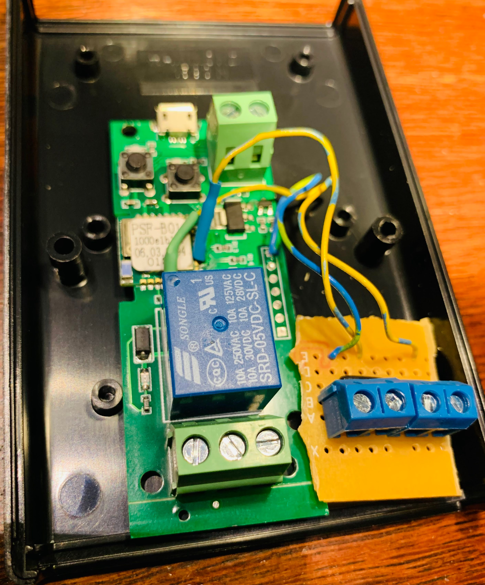
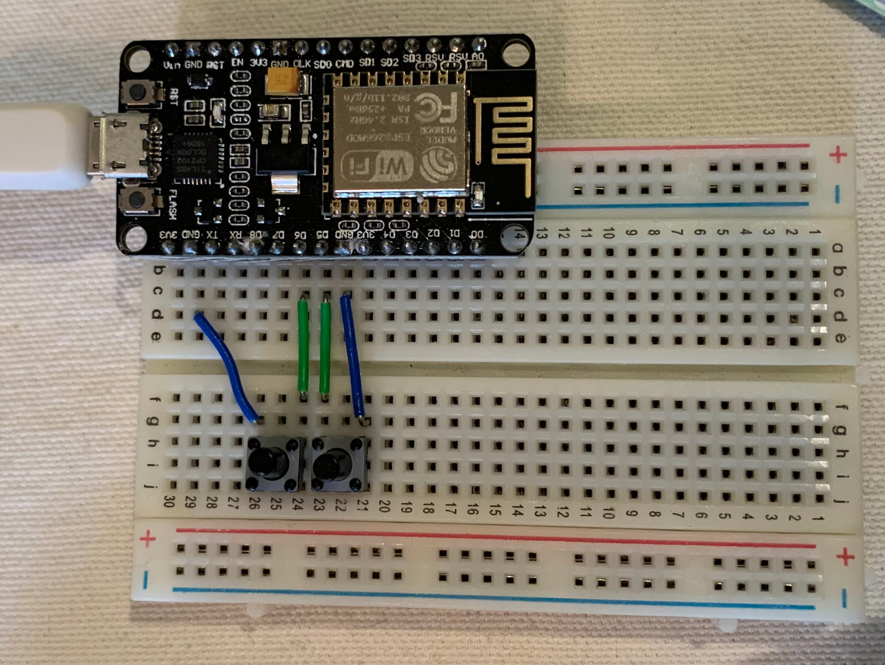
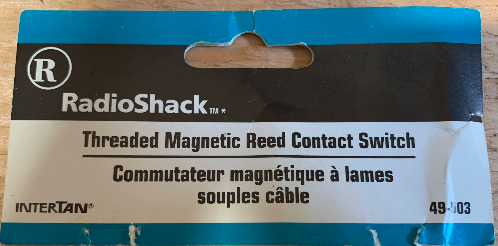
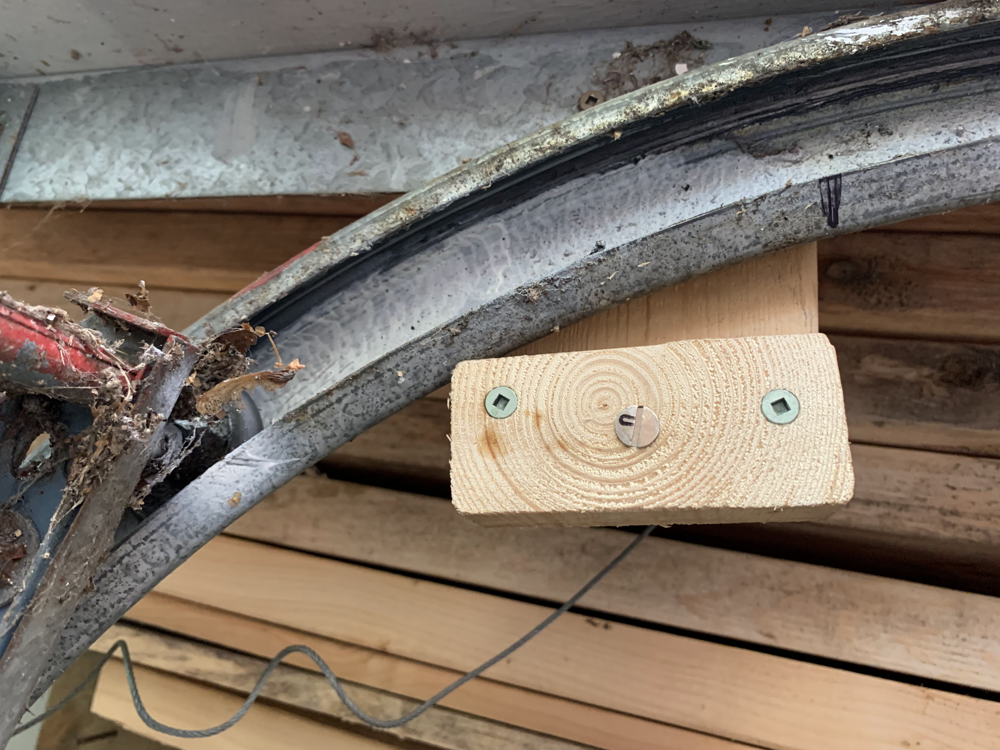
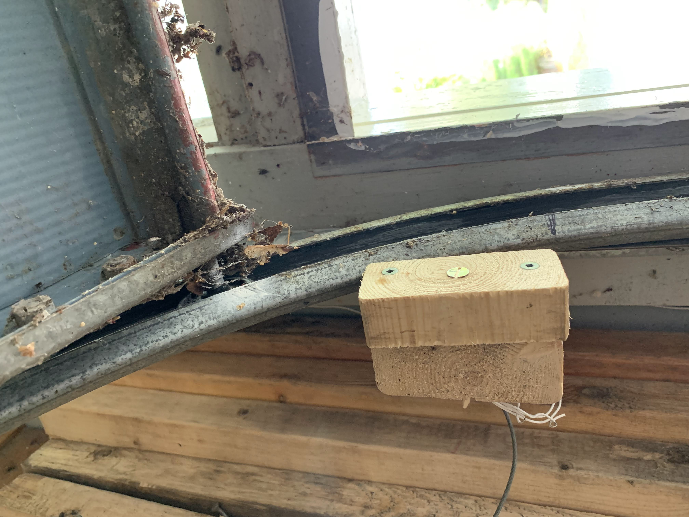
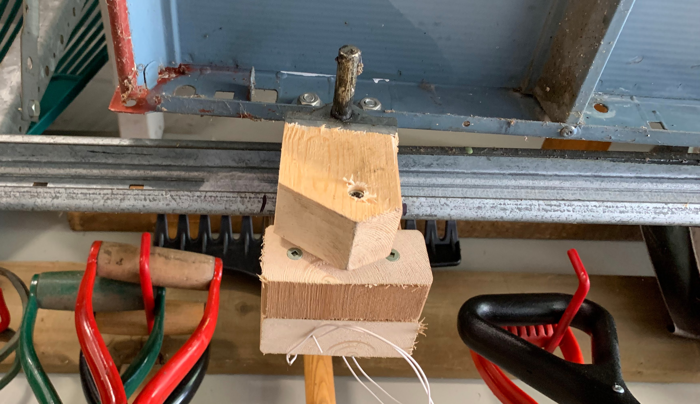
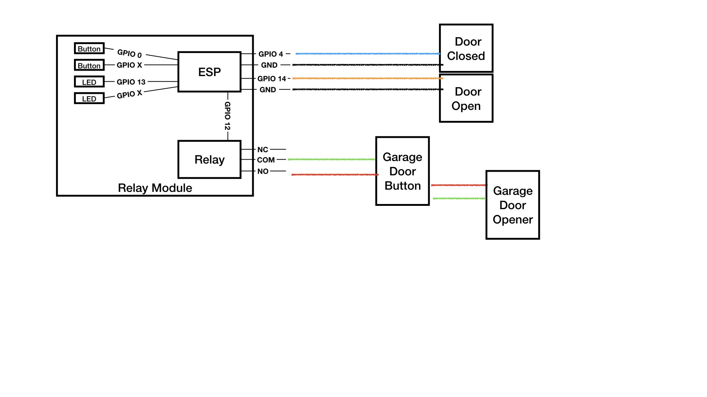

# Homebrew Garage Door Controller

I recently purchased a Chamberlain Garage Door opener and unfortunately or fortunately depending on your point of view it used the security 2.0 approach for buttons and controls.  And couldn't use a simple relay but needed to use a security 2.0 control, wire the relay to its button.  A bit of a headache but not insurmountable.

So to start the exercise I bought an additional push button for my door from Amazon ( https://www.amazon.ca/gp/product/B07W5RMN56/ref=ppx_yo_dt_b_asin_title_o00_s00?ie=UTF8&psc=1 ).

And soldered wires to the button, so it could be controlled from a simple relay.

Very delicate soldering.

## Garage Door ESP Board

To trigger the button with a relay, I used a Sonoff Basic Module Clone from AliExpress ( https://www.aliexpress.com/item/32947727657.html?aff_fcid=1f24d098273c4e3fa09f5de4490ef20a-1634258029081-03549-L56CgmdE&aff_fsk=L56CgmdE&aff_platform=link-c-tool&sk=L56CgmdE&aff_trace_key=1f24d098273c4e3fa09f5de4490ef20a-1634258029081-03549-L56CgmdE&terminal_id=efb594442341438f97166be2ec205bfb )

And flashed it with Tasmota 9.2.0

And added to it connections to two unused GPIO pins ( GPIO 4 and 14 ) to contact sensors to detect Garage Door Open and Closed.  I added a screw terminal block to connect the sensors to.

Going to mount it into these hammond project boxes I have been using.  Relay connection on the left ( green screw blocks ) and contact sensors on the right ( blue screw blocks ).

## Test NodeMCU / ESP8266

As part of the development phase, I build a small test unit on a breadboard to simulate the door.

The LED on the board lite's up when the garage door is controlled, and the two buttons simulate the reed switches.

## Open and Closed Contact sensors

I had managed to source some magnetic reed switches a few years ago from a Radio Shack close out sale, so installed one of each to be triggered when my garage door was open or closed.  I used wood for mounting etc, to avoid conflicting with the magnets.

To mount the sensors, I studied the movement of the door, and attached some wood blocks at the open and closed point, so I could use a common magnet attached to the door.

This is the closed reed switch.

Another shot of the closed reed switch.  The reed switch is just drilled thru the wood blocks.

This is the open reed switch and the magnet on the door block.

For the final wiring, GPIO4/Switch2 is wired to the OPEN Reed Switch, and GPIO14/Switch3 is wired to the CLOSED reed switch.

## Circuit diagram

