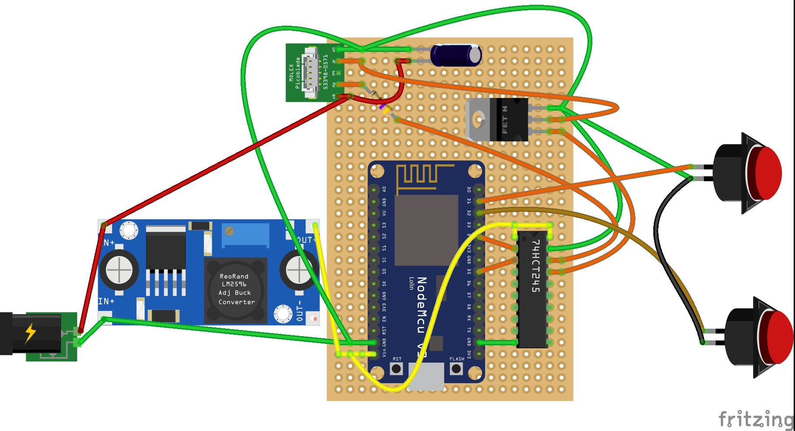
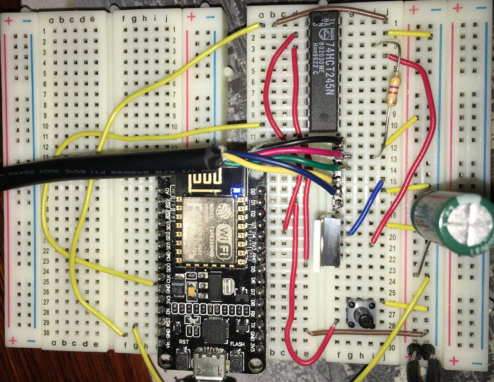
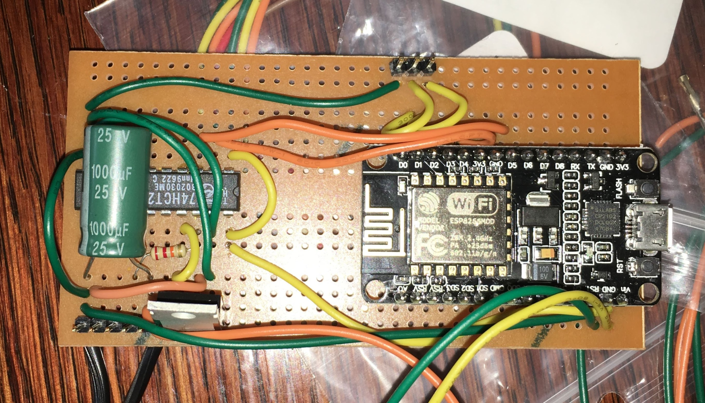
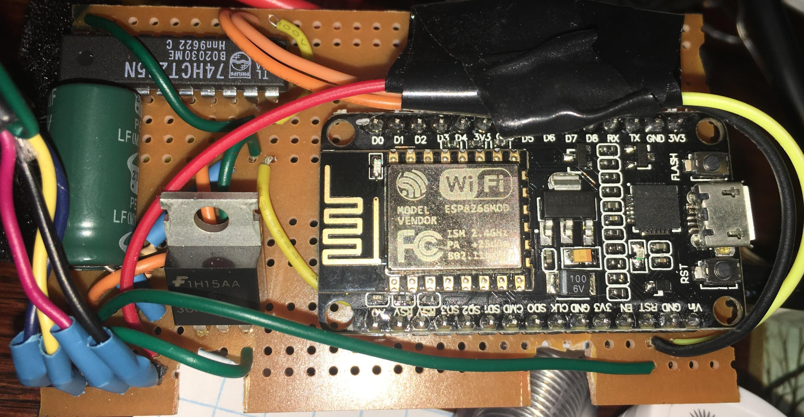
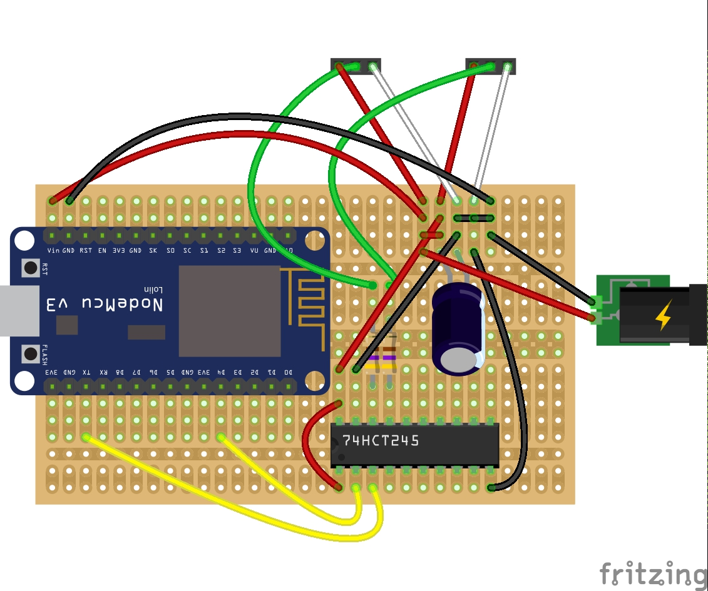
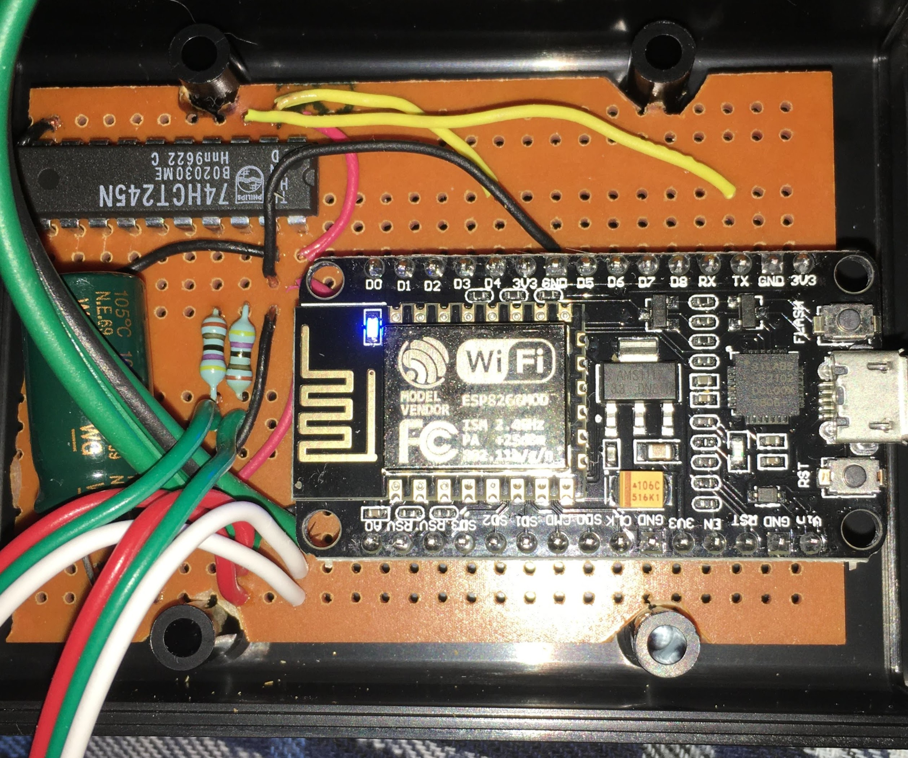

**homebridge-mculed** ESP8266 LUA Code

<!--ts-->
   * [Hardware - CLED](#hardware---cled)
   * [Circuit Diagrams - CLED](#circuit-diagrams---cled)
      * [Schematic](#schematic)
      * [Breadboard layout](#breadboard-layout)
      * [Actual Breadboard layout](#actual-breadboard-layout)
      * [Unit 1 - layout](#unit-1---layout)
      * [Unit 1 - Completed unit](#unit-1---completed-unit)
      * [Unit 2 - Completed unit](#unit-2---completed-unit)
   * [Tools](#tools)
   * [Hardware - RGBLED](#hardware---rgbled)
   * [Circuit Diagrams - RGBLED](#circuit-diagrams---rgbled)
      * [Schematic](#schematic-1)
      * [Stripboard layout](#stripboard-layout)
      * [Unit 1 - layout](#unit-1---layout-1)
      * [XMAS 2019 Final](#xmas-2019-final)
         * [LED Control Module](#led-control-module)
         * [Controller](#controller)
<!-- Added by: sgracey, at:  -->

<!--te-->

# Hardware - CLED

1.  Bill of materials
    -   nodeMCU / esp8266 dev kit
    -   ~~Level Shifter~~ - I received inconsistent behavior when using this and switch to 74HCT245
    -   74HCT245 - Level Shifter replacement
    -   1000uf 25V capacitor
    -   470 Ohm Resistor
    -   DC to DC Power Converter
    -   ~~78M05 Voltage Regulator~~ - I tried using the voltage regulator, but did not take into account the heat generated by lowering the voltage
    -   2 x Push Button switch
    -   FQP30N06L N-Channel MOSFET
    -   Case - Hammond 1593NBK

# Circuit Diagrams - CLED

## Schematic

## Breadboard layout

## Actual Breadboard layout

## Unit 1 - layout

## Unit 1 - Completed unit

## Unit 2 - Completed unit

# Tools

-   nodeMCU-uploader - Install instructions are here <https://github.com/kmpm/nodeMCU-uploader>
-   lua - Install instructions are here <https://www.lua.org/download.html>
-   esptool - Install instructions are here <https://github.com/espressif/esptool>
-   esplorer - Install instructions are here <https://esp8266.ru/esplorer/>

# Hardware - RGBLED

1.  Bill of materials
    -   50pcs DC5V 12mm WS2811 IC RGB Led Module Christmas String Green wire Waterproof IP68
    -   nodeMCU / esp8266 dev kit
    -   74HCT245 - Level Shifter replacement
    -   1000uf 25V capacitor
    -   2 x 470 Ohm Resistor
    -   5 VDC 3 Amp Power Supply
    -   2.1 MM DC Chassis Mount
    -   Case - Hammond 1593NBK

# Circuit Diagrams - RGBLED

## Schematic

## Stripboard layout

## Unit 1 - layout

## XMAS 2019 Final ##

### LED Control Module ###

For the final version for XMAS 2019, I switched to the [ESPPixelStick](https://github.com/forkineye/ESPixelStick) firmware rather than roll my own code.  While this worked really well, it did have an issue when rebooting and getting stuck in AP mode, also the ESP website was problematic.  Next year am thinking to reflash with WLED.

For hooking up the strips, I changed the plan at the last minute and ended up connecting both strips end to end.  And then looping back to the esp8266 for power injection at the end of the strip.

### Controller ###

To control the lights, I used [Falcon Player](https://github.com/FalconChristmas/fpp) running on a RPI, and to design the sequence I used xlights running from Bart.
